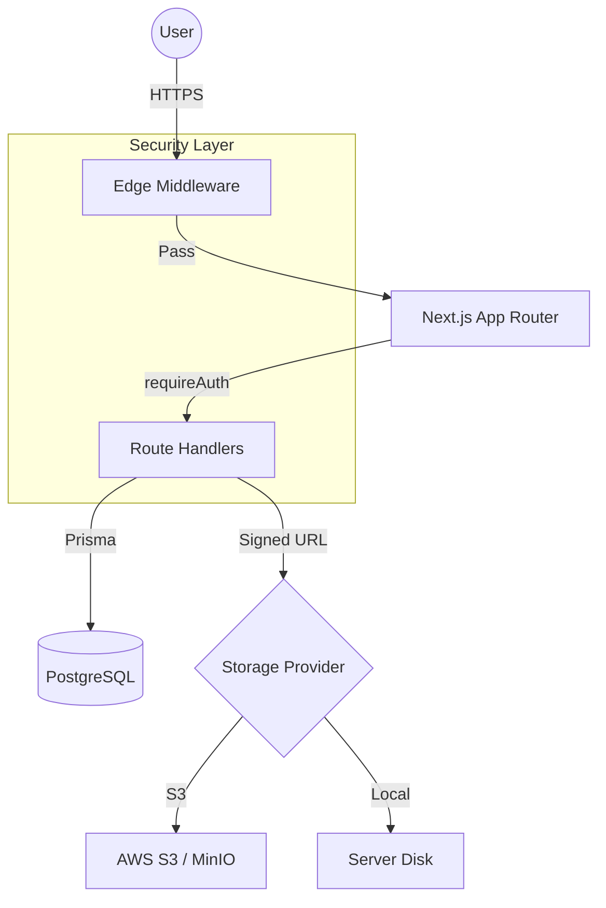

# VaultDrive 🚢 [](#)

VaultDrive is a production-grade, multi-user, cloud-agnostic file management platform built with Next.js, Auth.js, Prisma, and PostgreSQL. It delivers a secure, scalable, and premium storage experience tailored for private deployments.

## 💡 Why VaultDrive?

Most open-source storage solutions are either too complex (Enterprise) or lack basic security (Prototypes). **VaultDrive** was designed to bridge that gap by focusing on three core engineering challenges:
1.  **Strict Multi-Tenancy**: Zero-leakage user isolation using a "Security-by-Design" approach.
2.  **Storage Agnosticism**: A provider-based architecture that treats Local Disk and AWS S3 as interchangeable modules.
3.  **Modern DX/UX**: Leveraging Next.js App Router and Auth.js to provide a fast, secure, and visually premium interface.

## 🚀 VaultDrive V1.2 — Production Hardening Release

VaultDrive V1.2 marks the transition from a prototype to a secure, production-ready platform. This release focuses on authentication, data isolation, scalable storage access, and a refined user experience.

### 🔐 Security Architecture (Zero-Trust Multi-Tenancy)
VaultDrive enforces strict isolation between users at every layer:
- **Auth.js Integration**: JWT-based session management with Prisma Adapter for secure, scalable authentication.
- **Edge Middleware Guard**: All protected routes are verified at the edge, preventing unauthenticated access before render.
- **requireAuth() Pattern**: A unified backend guard ensures every API route is scoped by `ownerId`. Data leakage between users is structurally impossible.
- **Secure Storage**: Path traversal protection and user-specific storage directories (Local) or Keys (S3).

### 📦 Intelligent Storage Layer
The storage engine is fully cloud-aware and provider-agnostic:
- **Presigned Downloads (S3 / MinIO)**: Files are streamed directly from object storage using temporary signed URLs — eliminating server bottlenecks.
- **Recursive Cleanup Engine**: Deleting a folder guarantees all nested files are removed from the Database and the physical storage (Local Disk or S3-compatible storage).
- **Provider Abstraction**: Switching storage providers requires only a single `.env` change.

### ✨ Premium UI / UX
VaultDrive delivers a polished, desktop-grade experience:
- **Drag & Drop Uploads**: Global drop zones with real-time progress tracking.
- **Async Feedback**: Loading indicators, disabled states, and error toasts for all operations.
- **Navigation**: Glassmorphic sidebar with breadcrumb-based folder traversal.

---

## 🛠 Tech Stack
- **Framework**: Next.js 14+ (App Router)
- **Auth**: Auth.js (NextAuth v5)
- **Database**: PostgreSQL with Prisma ORM
- **Storage**: AWS SDK v3 (S3), Node.js `fs` (Local).
- **Testing**: Playwright (E2E).
- **Styling**: Tailwind CSS (Glassmorphism)

---

## 🏁 Getting Started

### 1. Environment Setup
Rename `.env.example` to `.env` and fill in your credentials:
```env
AUTH_SECRET="..."        # Generate with 'npx auth secret'
STORAGE_DRIVER="local"  # or "s3"
DATABASE_URL="postgresql://..."
```

### 2. Local Development
```bash
# 1. Start Services (PostgreSQL + MinIO)
docker-compose up -d

# 2. Setup Database
npx prisma generate
npx prisma db push

# 3. Run App
npm run dev
```
Access at `http://localhost:3000`.

### 3. Production (Docker)
```bash
# Full production stack (Migrations + App)
docker compose -f docker-compose.prod.yml up -d --build
```
Access at `http://localhost:3001`.

---

### 🔍 Verification & Quality
- [x] **Auth & Isolation**: Unauthorized users redirected; User A cannot access User B’s files.
- [x] **File Operations**: Drag-and-drop uploads; Rename & Move updates reflected immediately.
- [x] **Signed URLs**: Verified direct streaming from S3 via presigned links.
- [x] **Cleanup**: Recursive deletion confirmed across DB and Storage.
- [x] **E2E Testing**: Comprehensive [Playwright Suite](./TESTING.md) covering Auth, Files, and Folders.

---

## 🗺 Architecture

VaultDrive uses a decoupled architecture to ensure security and scalability.



See the [Full ARCHITECTURE.md](./ARCHITECTURE.md) for a deep dive into the system design, auth flows, and storage abstraction.

## 📜 License
MIT
