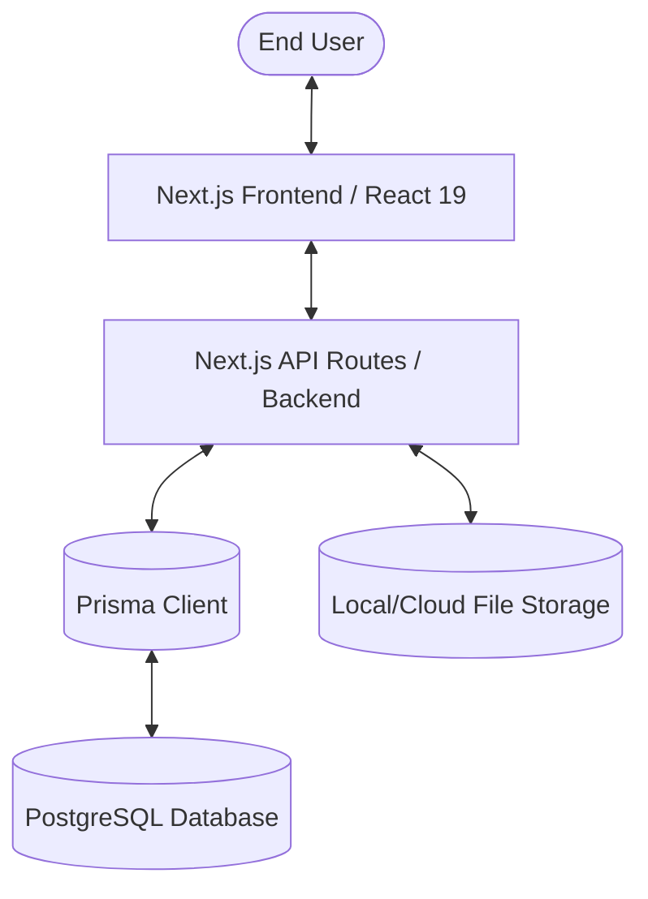
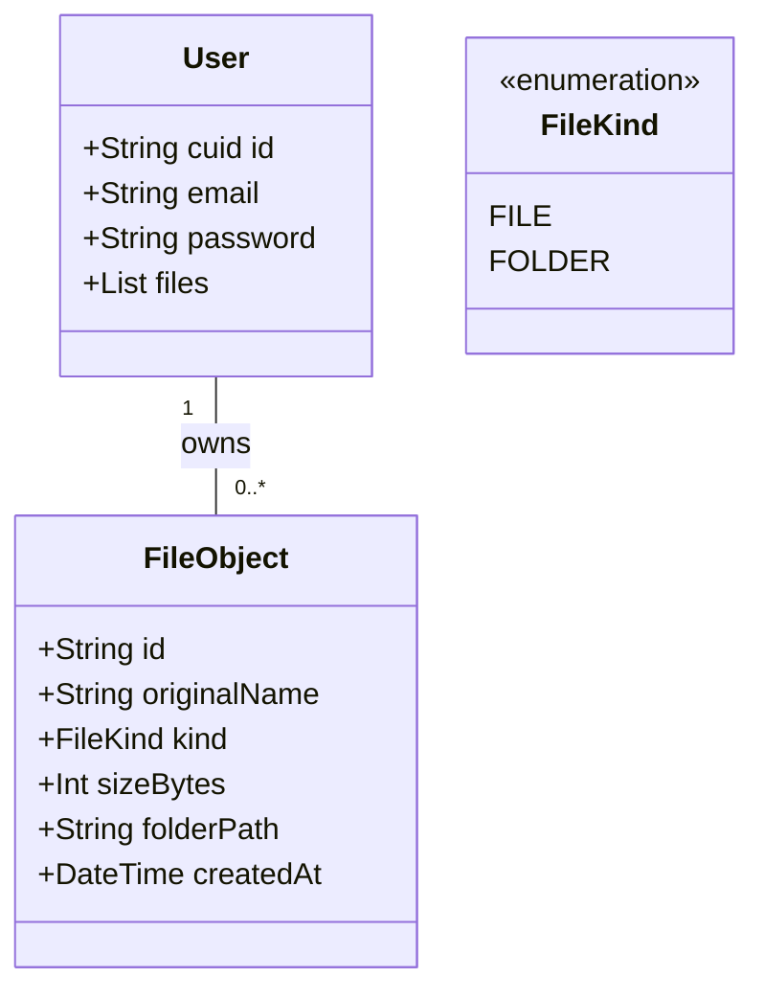
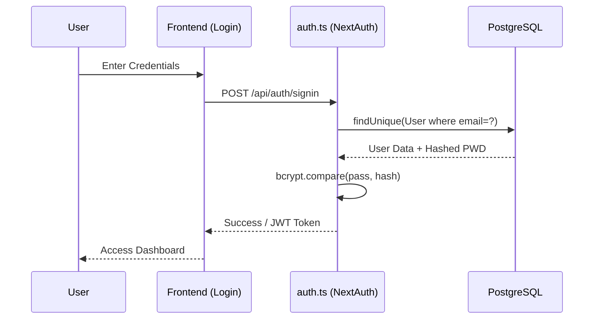
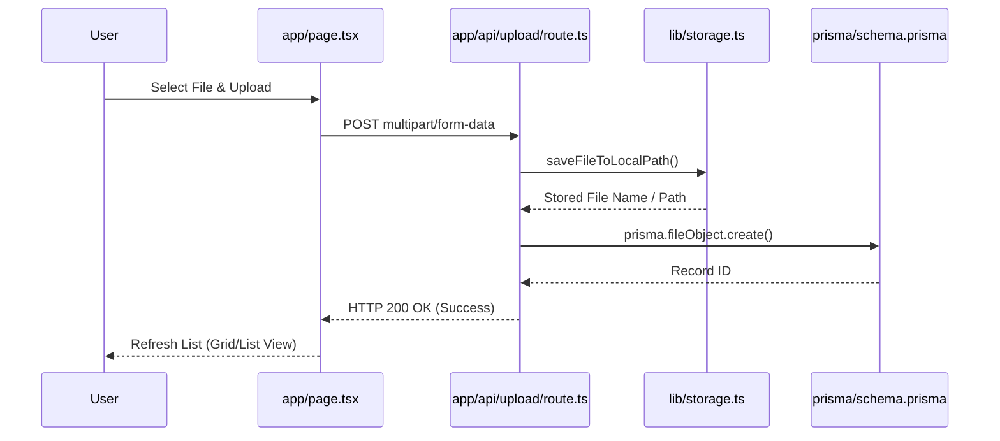
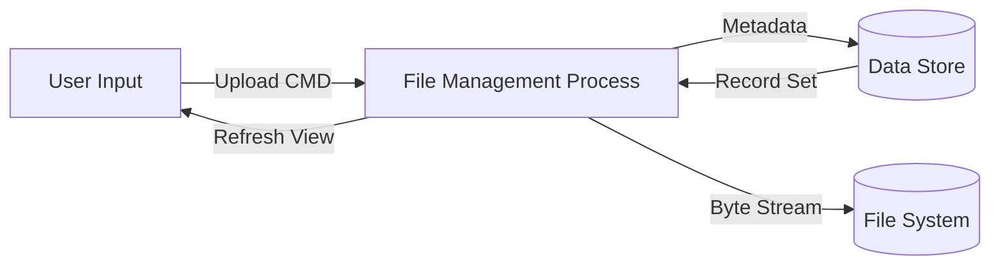

# Technical Design & UML Specification

This document provides a deep architectural breakdown of VaultDrive, utilizing standard UML notation and Mermaid.js visualization.

## 1. System Architecture (High-Level)
The system follows a standard 3-tier architecture: Presentation, Logic/Application, and Persistence.



### Components:
- **Presentation Layer**: `app/page.tsx` (Main Dashboard).
- **Application Layer**: API routes in `app/api/`.
- **Logic Layer**: Business logic handles in `lib/` and `auth.ts`.
- **Persistence Layer**: `prisma/schema.prisma` and physical storage in `/uploads`.

---

## 2. Component Diagram
Shows the physical modules and their dependencies.

```mermaid
component "VaultDrive Interface" {
  [HomePage] --> [AuthGuard]
  [HomePage] --> [FileBrowser]
  [FileBrowser] --> [StorageAPI]
}

component "Backend Services" {
  [AuthService] --> [NextAuth]
  [StorageAPI] --> [PrismaClient]
  [StorageAPI] --> [FileSystem]
}

[NextAuth] ..> [PostgreSQL]
[PrismaClient] ..> [PostgreSQL]
```

---

## 3. Class Diagram (Data Entities)
Mapping the Prisma models to logical class structures.



---

## 4. Sequence Diagram: Authentication Flow
Major workflow for system access.



---

## 5. Sequence Diagram: File Deployment (Upload)
Major workflow for resource management.



---

## 6. Use Case Diagram
High-level system interactions.

```mermaid
useCaseDiagram
    actor "System Operator" as A
    rectangle "VaultDrive Platform" {
        usecase "Authenticate (MFA)" as UC1
        usecase "Deploy File Object" as UC2
        usecase "Manage System Nodes" as UC3
        usecase "Execute System Directives" as UC4
        usecase "Toggle View Mode" as UC5
    }
    A --> UC1
    A --> UC2
    A --> UC3
    A --> UC4
    A --> UC5
```

---

## 7. Data Flow Diagram (DFD Level 1)



---
**Verification**: All diagrams verified against code in `app/`, `lib/`, and `prisma/`.
**Standard**: UML 2.5 compliant.
