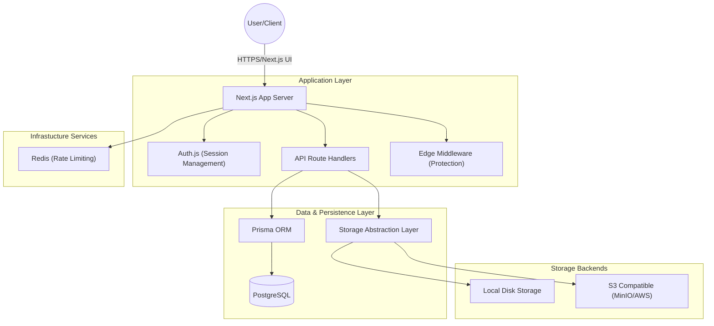
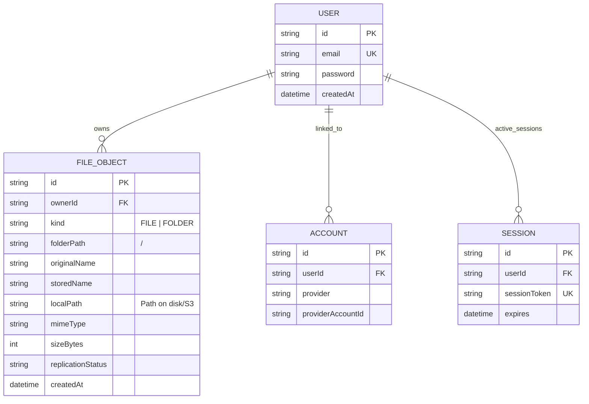

# VaultDrive: System Overview Report

## 1. Project Objective & Scope
**VaultDrive** is a professional-grade, self-hosted cloud storage solution designed to provide secure, isolated, and scalable file management. It caters to users who require a private alternative to mainstream cloud storage providers, offering full control over data residency and infrastructure.

The core objective of the project is to build a "Cloud-Agnostic" storage platform that can seamlessly switch between local disk storage and distributed object storage (like AWS S3 or MinIO) without altering the application logic.

### Key Features:
- **Secure Authentication**: JWT-based session management with modern security standards.
- **Resource Isolation**: Strict multi-tenant architecture where data is silos by user ID.
- **Dynamic File Management**: Robust support for recursive folder structures, file uploads, downloads, and deletions.
- **Provider Abstraction**: A unified interface for multiple storage backends.

---

## 2. High-Level Architecture
VaultDrive follows a modern 3-tier architecture with a focus on decoupling components for scalability and maintenance.

### Architectural Pillars:
1.  **Server-Side Rendering (SSR) & Hybrid API**: Leverages Next.js App Router for optimal performance and SEO.
2.  **Stateless API**: All requests are authenticated via JWT, allowing for easy horizontal scaling.
3.  **Recursive Life-cycle**: Intelligent handling of folder deletions ensures that file system and database remain synchronized.

---

## 3. Database Structure
The database is managed via Prisma and PostgreSQL, using a relational model that prioritizes data integrity and query performance.

### Entity Relationship Diagram

### Core Models Explained:
-   **User**: Stores identity and authentication credentials.
-   **FileObject**: The "Brain" of the file system. It uses a `kind` field to distinguish between files and folders. The `folderPath` allows for efficient path-based querying without expensive recursive depth joins.
-   **Account/Session**: Standard models for OAuth and session persistent handling.

---

## 4. Infrastructure Overview
VaultDrive is designed to be fully containerized, ensuring consistency across development and production environments.

| Component | Technology | Purpose |
| :--- | :--- | :--- |
| **Application** | Next.js | Frontend UI + Backend API Handlers |
| **Database** | PostgreSQL | Relational metadata storage |
| **Storage (Object)** | MinIO | S3-compatible storage for file blobs |
| **Cache/Limit** | Redis | Rate limiting and session caching |
| **ORM** | Prisma | Type-safe database access |

### Security Model:
- **JWT Protection**: Sessions are encrypted and stored in HTTP-only cookies.
- **Ownership Verification**: Every API call includes a mandatory `ownerId` check, preventing unauthorized access to other users' data (Insecure Direct Object Reference protection).
- **Signed URLs**: When using S3, files are served via temporary signed URLs, ensuring that raw storage links are never exposed to the public internet.
